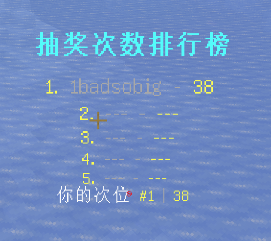
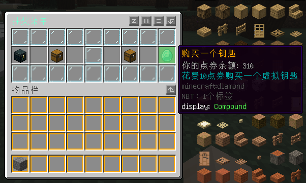

# 如何实现新版本阉割的内容


## 排行榜

这里用的1.20.1+

https://www.mcbbs.net/thread-1369947-1-1.html



具体操作可看对应教程

```yaml
- lines:
  - content: '&b&l抽奖次数排行榜'
    height: 0.4
  - content: '&e1. &7%ajlb_lb_XL2_total_1_alltime_displayname% - &e%ajlb_lb_XL2_total_1_alltime_value_formatted%'
    height: 0.3
  - content: '&e2. &7%ajlb_lb_XL2_total_2_alltime_displayname% - &e%ajlb_lb_XL2_total_2_alltime_value_formatted%'
    height: 0.3
  - content: '&e3. &7%ajlb_lb_XL2_total_3_alltime_displayname% - &e%ajlb_lb_XL2_total_3_alltime_value_formatted%'
    height: 0.3
  - content: '&e4. &7%ajlb_lb_XL2_total_4_alltime_displayname% - &e%ajlb_lb_XL2_total_4_alltime_value_formatted%'
    height: 0.3
  - content: '&e5. &7%ajlb_lb_XL2_total_5_alltime_displayname% - &e%ajlb_lb_XL2_total_5_alltime_value_formatted%'
    height: 0.3
  - content: '&f你的次位 &e#%ajlb_position_XL2_total_alltime% &7| &e%ajlb_value_XL2_total_alltime_formatted%'
    height: 0.4
```


## 商店购买与抽奖菜单

这里我使用Trmenu+1.20.1为例





```yaml
Title: '&x&7&F&F&F&D&4抽奖菜单' 
Layout:
  - '#########' 
  - 'A B # C D' 
  - '#########' 

#预览 单抽 十连抽 购买一个

Icons: 
  '#': 
    display: 
      material: glass_panel 
      name: '&7&l无法到达的边界'
      lore:
        - '&7有一个声音对你说:你拿不走我的' 
  A: 
    display: 
      material: ENDER_CHEST 
      name: '&6预览奖池' 
      lore: 
      - ''
      - '&3点击预览奖池奖品'
    actions: 
      all: 
        - 'command: xgplottery2 preview default'
  B:
    display: 
      material: chest 
      name: '&6单抽！' 
      lore: 
      - '&7你的点券余额: %playerpoints_points%'
      - '&310点券购买并 单抽出奇迹！'
    actions: 
      all: 
        - condition: check papi *%playerpoints_points% >= 10 
          actions:
            - 'console: xgplottery2 draw %player_name% default'
            - 'take-points: 10'
          deny:
            - 'tell: &c无法购买！钱不够.'
  C:
    display: 
      material: chest 
      name: '&6十连抽！' 
      lore: 
      - '&7你的点券余额: %playerpoints_points%'
      - '&390点券购买并 十连抽出奇迹'
    actions: 
      all: 
        - condition: check papi *%playerpoints_points% >= 90
          actions:
            - 'console: xgplottery2 draw %player_name% default multiple'
            - 'take-points: 90'
          deny:
            - 'tell: &c无法购买！钱不够.'
  D:
    display: 
      material: DIAMOND
      name: '&6购买一个钥匙' 
      lore: 
      - '&7你的点券余额: %playerpoints_points%'
      - '&3花费10点券购买一个虚拟钥匙'
    actions: 
      all: 
        - condition: check papi *%playerpoints_points% >= 10 
          actions:
            - 'console: xgplottery2 key add %player_name% default 1'
            - 'take-points: 10'
          deny:
            - 'tell: &c无法购买！钱不够.'
```

