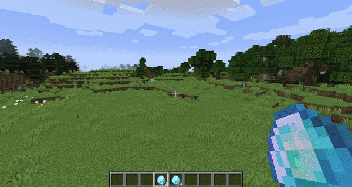
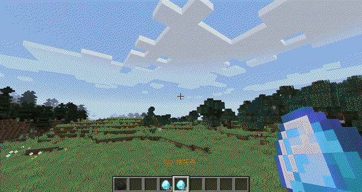
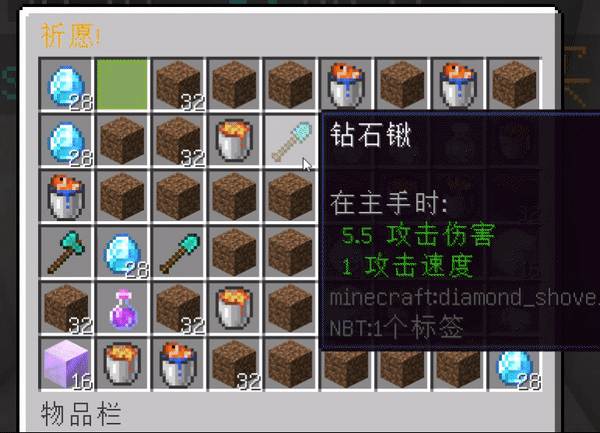
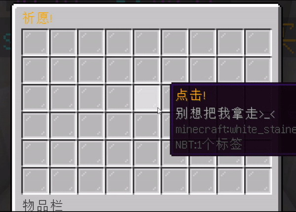
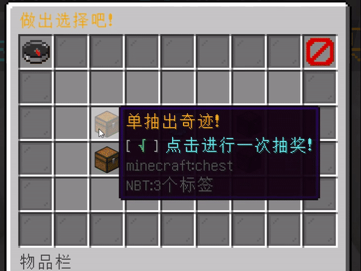
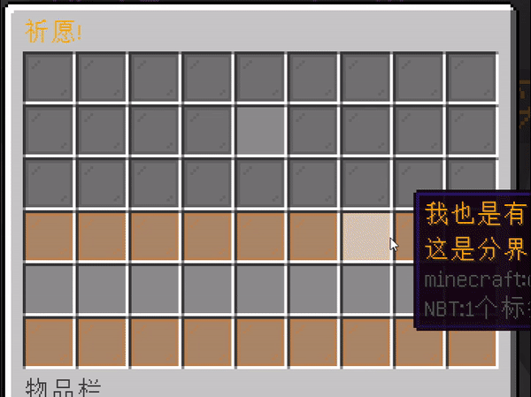

# 抽奖动画

（抽奖动画没什么特别大的变化，就用之前的图吧）

## 单抽

单抽在本插件的奖池配置中内是 animation

每一个抽奖动画都拥有它本身的占用名，在奖池配置文件中修改对应值来做到更换动画（注意大写）。

例如例子中的 animation: "Default" 就是第一个抽奖动画：

- 占用名：Default

（这个抽奖动画在使用抽奖箱右键打开且服务端版本为1.16+的情况下，你会看到箱子/末影箱打开并飞出烟花。怎么样，是不是很帅！）

- 占用名：Select

- 占用名: Marquee

- 占用名: Colorful

另外，还有一个特殊的抽奖动画，占用名为：Void  。如其名，这个抽奖动画没有任何的动画，抽奖之后会立即获得物品。

## 十连抽

十连抽同上，通过设置multipleAnimation来设置

- 占用名: DefaultMultiple

- 占用名: BoxMultiple

- 占用名: SelectMultiple

- 占用名: SimpleMultiple

【图】 ... 懒得做了 服务器里看吧