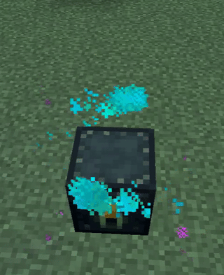
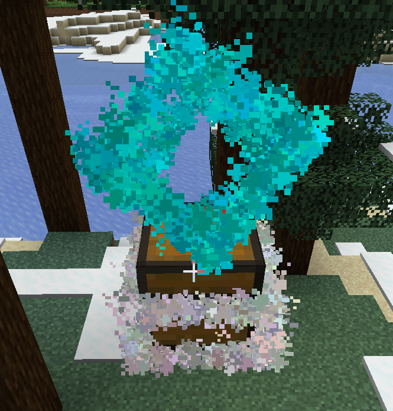

# 抽奖箱

crate ！ 然后，什么是抽奖箱？ 放在地上的箱子才叫抽奖箱啊！

玛德之前的版本有多少人说没办法创建抽奖箱，没办法创建抽奖箱。 你都没创建奖池怎么创建抽奖箱？ 意思是放个空盒子让大家抽就完事了。


创建抽奖箱，你需要在创建完奖池后使用`Crate`子命令。


## 抽奖箱粒子特效

你需要安装

ParticleLib 1.5.1+

- ParticleLib 一款粒子特效库

  MCBBS: [ParticleLib | (mcbbs.net)](https://www.mcbbs.net/thread-1429983-1-2.html)

现在自带两种粒子特效：

【A】 DefaultParticle



【B】 CubeParticle



需要自定义请了解开发内容


## 抽奖箱信息文件

抽奖箱信息存在插件文件夹内的crates.yml中

```yaml
d1ae5614-c319-4ce1-8f8a-f066f5fadd3c:
  x: 132.0
  y: 83.0
  z: 184.0
  world: world
  lottery: default
  particle: DefaultParticle
9bf9bf07-68c9-44c4-9b74-6bb35012b068:
  x: 124.0
  y: 83.0
  z: 184.0
  world: world
  lottery: default
  particle: DefaultParticle
```


更改其中的particle即可更换粒子特效.


如果你用了一些配置文件同步,请不要同步这个文件.


- **插件启用方法** 输入指令 `/xgplottery2 help 62a79341-7adb-4791-a1c4-d829f237f033`